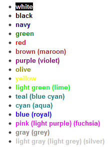
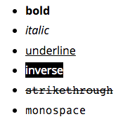

# irc.colors.js

Easily use colored output and formatting in your irc bots.

[](http://travis-ci.org/fent/irc-colors.js)
[](https://david-dm.org/fent/irc-colors.js)
[](https://codecov.io/gh/fent/irc-colors.js)


# Usage

```javascript
const c = require('irc-colors');
...
ircbot.say('#chan', c.blue('hello everyone')); // prints blue text
ircbot.say('#chan', c.underline.red('WARNING')); // can be chained
ircbot.say('#chan', c.white.bgblack('inverted')); // white text with black background

warn = c.bold.red.bgyellow;
ircbot.say('#chan', warn('BIGGER WARNING')); // bold red text with yellow background
ircbot.say('#chan', c.rainbow('having fun!'); // prints rainbow colored text
```

### But wait, there's more!

If you don't mind changing the prototype of the String object, then use the global() function.

```javascript
require('irc-colors').global()
...
ircbot.say('#chan', 'say something'.irc.red()); // prints red text
ircbot.say('#chan', 'hi everyone!'.irc.green.bold()); // prints green bold text
ircbot.say('#chan', 'etc etc'.irc.underline.grey.bgblack()) // chains work too
```

Global syntax was inspired by [colors.js](https://github.com/marak/colors.js) and because of that, there's possibility that you might want to use that module along with this one. That's why the *irc* property of a String needs to be called first to use the formatting functions.


## Colors



Original name or alternate can be used, without spaces

    bot.say('#chat', c.bluecyan('hi'));


## Styles




## Extras


## Strip

You can also strip out any colors/style from IRC messages.

* `stripColors`
* `stripStyle`
* `stripColorsAndStyle`

```js
const c = require('irc-colors');

ircbot.on('message', function(from, message) {
  console.log(c.stripColorsAndStyle(message));
});
```


# Install

    npm install irc-colors


# Tests
Tests are written with [vows](http://vowsjs.org/)

```bash
npm test
```


# License

MIT
